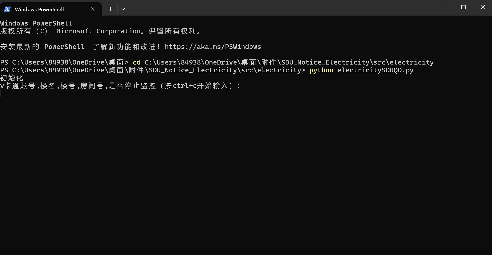
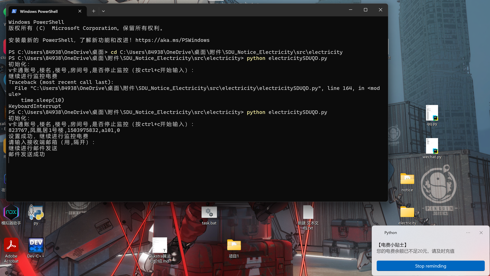
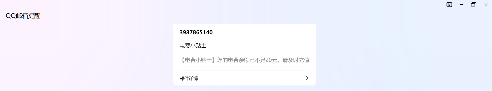
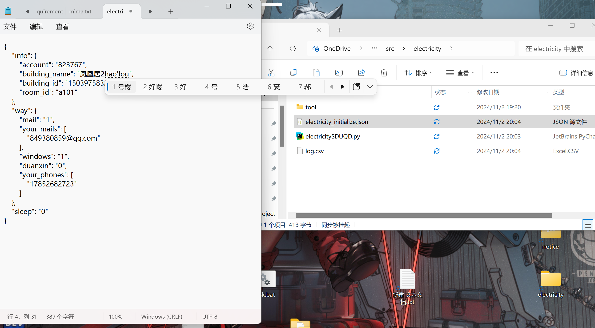

# SDU_Notice_Electricity
### SDU_Notice_Electricity是您在SDUQD打赢信息战的超级利器！
### Notice：捕获通知
###### 功能：
all_noticeSDU：获取各个网站的全部通知并按时间顺序保存到同一张.xlsx表中
recent_noticeSDU：获取各个网站的近期通知并按时间顺序保存到同一张.xlsx表中，支持定时执行
###### 使用方法：
***系统：win10/11  ，   解释器python3.12***
将代码clone下来，然后运行你需要的功能对应的.py文件：获取全部(all)或者近期(recent)的通知
”recent“首次运行需要进行初始化，可从两种方法中选适合自己的：
1. 在窗口中按要求初始化：
  打开界面
  
  初始化和得到的通知
  
  
2. 直接修改json文件中的对应的值：
  

”recent“的定时执行功能：

> 首先需要创建一个批处理文件start.bat，内容如下：
> python E:\TEST.py       # .py文件的绝对路径
> pause
> 然后WIN+R，输入`shell:star`，把批处理文件放在这个文件夹中，再开机TEST.py文件即可以自> 动启动。
### Electricity：电费提醒
###### 功能：
electricitySDUQD：查询选定宿舍房间的电费余额，支持定时执行并在余额不足时进行多渠道提醒
###### 初始化：
首先运行create_building_info.py获取各楼名和对应楼号，方便填写
然后同Notice,窗口中填写或直接修改json文件
启动监控功能的话同Notice

### ***注意：***
对于支持定时执行的文件，每次启动时都有通过窗口初始化的流程，按`ctrl+c`开始输入；如果不需修改信息，等待一小会儿程序就会继续运行。

